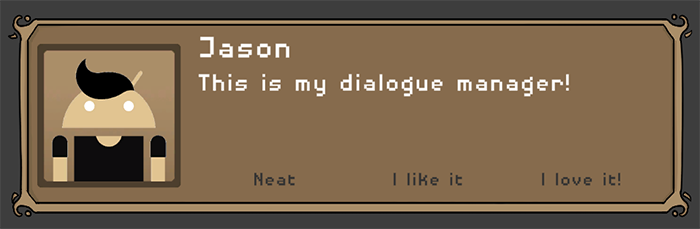
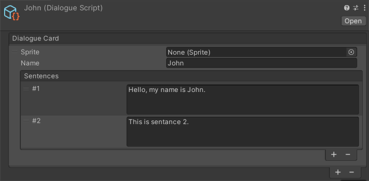

# Dialogue Manager
An RPG styled UI dialogue manager. Supports multiple lines of text, NPC portraits and option buttons.



## How to install
This package can be installed through the Unity `Package Manager` with Unity version 2019.3 or greater.

Open up the package manager `Window/Package Manager` and click on `Add package from git URL...`.


Paste in this repository's url.

`https://github.com/Jason-Skillman/Dialogue-Manager.git`


Click `Add` and the package will be installed in your project.

---
**NOTE:** For Unity version 2019.2 or lower

If you are using Unity 2019.2 or lower than you will not be able to install the package with the above method. Here are a few other ways to install the package.
1. You can clone this git repository into your project's `Packages` folder.
1. Another alternative would be to download this package from GitHub as a zip file. Unzip and in the `Package Manager` click on `Add package from disk...` and select the package's root folder.

---

### Git submodule
Alternatively you can also install this package as a git submodule.

```console
$ git submodule add https://github.com/Jason-Skillman/Dialogue-Manager.git Packages/Dialogue-Manager
```

## How to setup
You can create a new dialogue manager and add it to the hierarchy by going to `Create/Dialogue/Dialogue Manager`. Only one dialogue manager should exist within any given scene.

## How to create a script
You can create a new dialogue script asset and add it to your project by going to `Create/Dialogue/Dialogue Script`. This is where all of the speaker's dialogue will be. Each speaker has a sprite, name and a list of sentances. More speakers can be added to the same script.



## How to trigger the dialogue
To trigger the dialogue script, call the `TriggerDialogue()` method on the `DialogueScript` scriptable object asset. This can either be done through code or an event. This will then hand the script over the the dialogue manager and the UI will start playing.

## Option buttons
Option buttons can be added to the end of the script for more in-depth conversations. Up to four options can be added to each script. Each option has a name and the next dialogue script to play. Ex. "Yes, Maybe, No". You can also use the unity event for other kinds of interactions.
